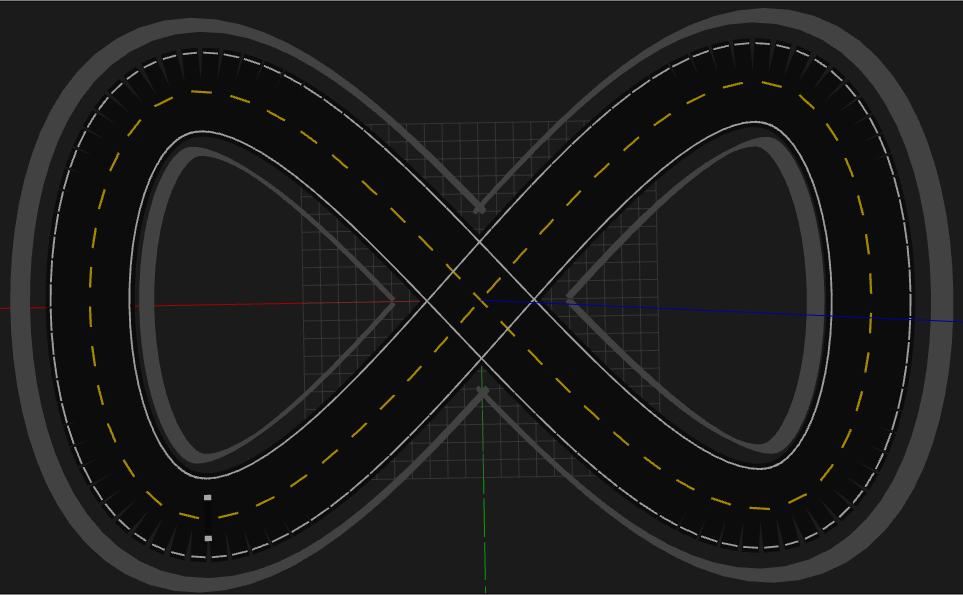
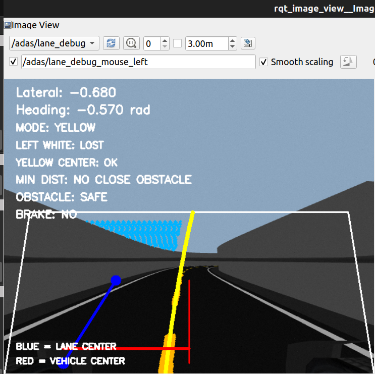
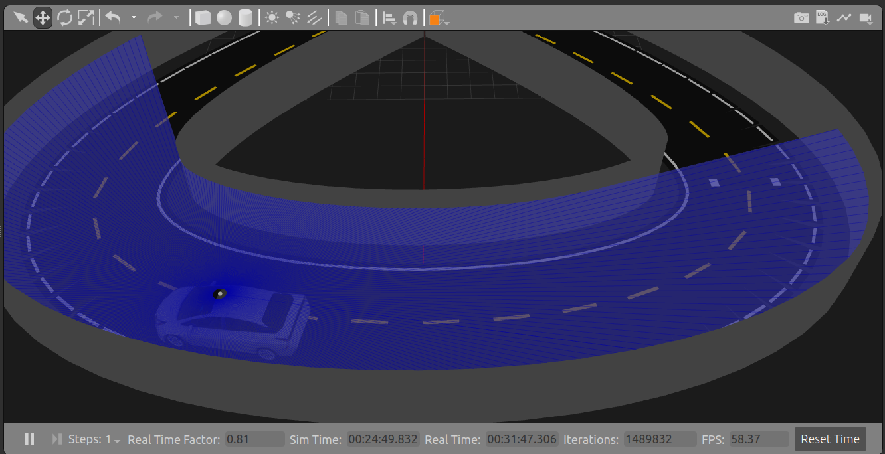
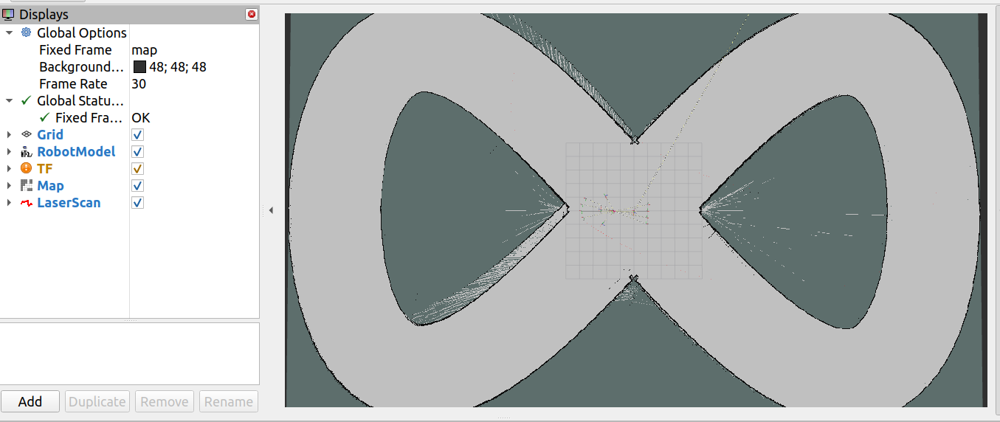
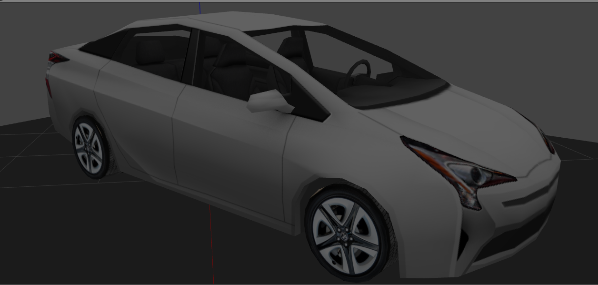
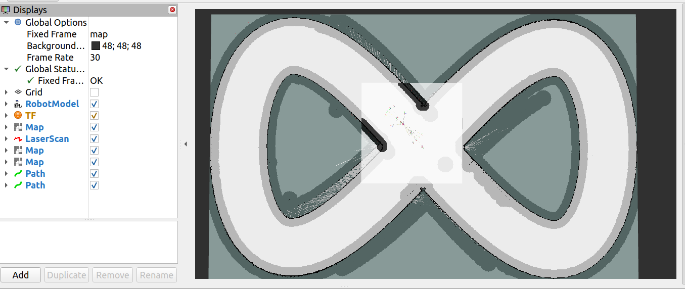
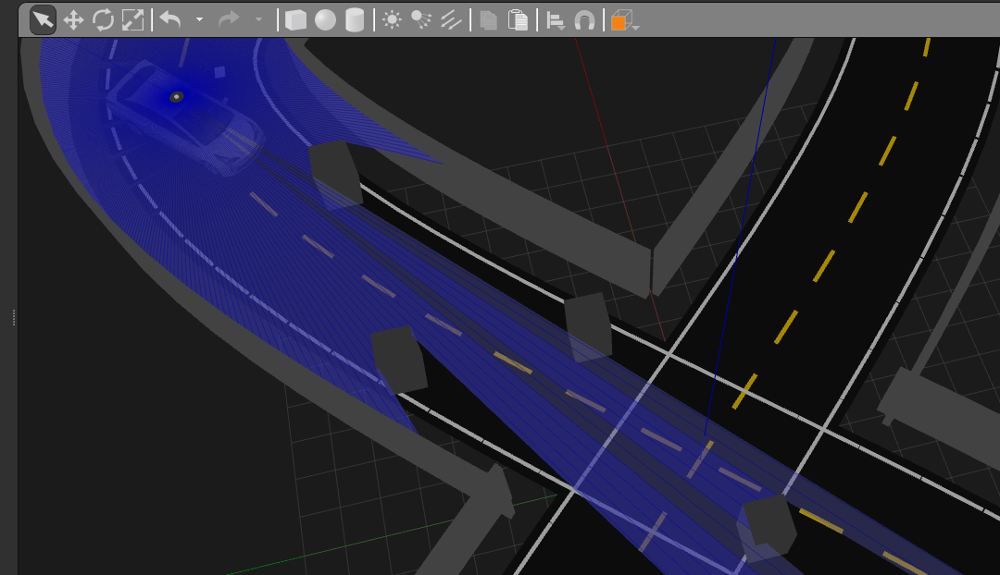
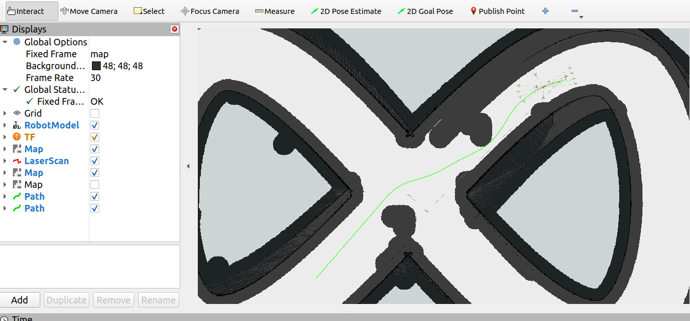

# 🚗 Prius ADAS — ROS 2 + Gazebo Classic

A ROS 2 Humble simulation of a Prius-style car for **autonomous lane following** and **ADAS navigation with dynamic obstacle replanning**.

> **Simulation project:** no physical Prius hardware is required to reproduce the core system.

## 📸 Project Screenshots

<table>
<tr>
<td></td>
<td></td>
</tr>
<tr>
<td></td>
<td></td>
</tr>
<tr>
<td></td>
<td></td>
</tr>
<tr>
<td></td>
<td></td>
</tr>
</table>

## ✨ Features

- 🚘 Prius-style vehicle simulation in Gazebo Classic
- 🛣️ Camera-based lane detection and autonomous lane following
- 📡 LiDAR-based perception
- 🗺️ SLAM Toolbox for mapping/localization
- 🧭 Nav2 navigation for goal-based driving
- 🧠 Smac Hybrid-A* for car-like global planning
- 🎯 Regulated Pure Pursuit for path following
- 🛡️ Collision Monitor for slow/stop safety behavior
- 🔄 Dynamic obstacle detection and path replanning
- 📺 RViz2 visualization

---

## 🧩 System Overview

### Part 1 — Autonomous Lane Following

```text
Front Camera
     ↓
lane_detection
     ↓
Lane Information
     ↓
autonomous_driver
     ↓
/prius/control
     ↓
Prius
```

### Part 2 — SLAM + Nav2 ADAS

```text
LiDAR + Odometry / TF
          ↓
     SLAM Toolbox
          ↓
   Map / Localization
          ↓
         Nav2
    ┌─────┼─────────┐
    ↓     ↓         ↓
 Planner Controller Costmaps
    └─────┼─────────┘
          ↓
 Collision Monitor
          ↓
 nav2_cmd_to_prius
          ↓
  /prius/control
          ↓
        Prius
```

---

## 🧱 Hardware Stack

### Vehicle / Sensor Stack (Simulated)

| Component | Role |
|---|---|
| Prius-style vehicle | Ackermann/car-like platform |
| Front RGB camera | Lane perception |
| LiDAR | Obstacle sensing + SLAM |
| Wheel/vehicle odometry | Motion estimation |
| Steering + throttle interface | Vehicle control |
| Gazebo Classic | Vehicle + sensor simulation |
| RViz2 | Navigation visualization |

### Host Software Stack

| Layer | Version / Tool |
|---|---|
| OS | Ubuntu 22.04 |
| Middleware | ROS 2 Humble |
| Simulator | Gazebo Classic 11 |
| Navigation | Nav2 |
| Mapping | SLAM Toolbox |
| Visualization | RViz2 |
| Perception | Python + OpenCV |

---

## 🚀 Installation & Build

### Requirements

- Ubuntu 22.04
- ROS 2 Humble
- Gazebo Classic
- Nav2
- SLAM Toolbox
- RViz2
- Python 3
- OpenCV
- Prius simulation dependency workspace at `~/prius_ws`

### Build

```bash
cd ~/prius_adas_ws

source /opt/ros/humble/setup.bash
source ~/prius_ws/install/setup.bash

colcon build --symlink-install
source ~/prius_adas_ws/install/setup.bash
```

Verify:

```bash
ros2 pkg executables prius_adas_control
ros2 pkg executables prius_adas_navigation
```

---

# 🛣️ Part 1 — Autonomous Lane Following

## Terminal 1 — Start Gazebo + Prius

```bash
source /opt/ros/humble/setup.bash
source ~/prius_ws/install/setup.bash
source ~/prius_adas_ws/install/setup.bash

ros2 launch prius_adas_control prius_adas_world.launch.py
```

**What it does:** starts the Gazebo world, Prius, robot state publishing and navigation support nodes required by the simulation.

**Behind the concept:** this terminal creates the simulated vehicle, sensors, TF and odometry that the lane-following nodes consume.

## Terminal 2 — Start Lane Detection

```bash
source /opt/ros/humble/setup.bash
source ~/prius_ws/install/setup.bash
source ~/prius_adas_ws/install/setup.bash

ros2 run prius_adas_control lane_detection
```

**What it does:** reads the front camera and estimates the visible lane geometry.

**Behind the concept:** the detector uses classical computer vision: image smoothing → color filtering → edge detection → region of interest → Hough line detection → left/right lane estimation.

Reference concept:
https://resources.altium.com/p/lane-recognition-and-tracking-nvidia-jetson-nano

## Terminal 3 — Start Autonomous Driver

```bash
source /opt/ros/humble/setup.bash
source ~/prius_ws/install/setup.bash
source ~/prius_adas_ws/install/setup.bash

ros2 run prius_adas_control autonomous_driver
```

**What it does:** converts lane information into steering and vehicle commands.

**Behind the concept:** the driver tries to keep the vehicle aligned with the detected lane center and publishes the final Prius control command.

### Lane-Following Flow

```text
Camera Image
    ↓
Lane Perception
    ↓
Lane Center / Geometry
    ↓
Steering Decision
    ↓
/prius/control
    ↓
Prius Motion
```

> There is **no separate controller launch file** for Part 1. `lane_detection` and `autonomous_driver` are started directly with `ros2 run`.

---

# 🧭 Part 2 — SLAM + Nav2 ADAS

## Terminal 1 — Start Gazebo + Prius

Use the same command as Part 1:

```bash
ros2 launch prius_adas_control prius_adas_world.launch.py
```

**What it does:** starts the simulation, vehicle, sensors, TF and odometry.

## Terminal 2 — Start SLAM / Localization

```bash
ros2 launch prius_adas_control slam.launch.py
```

**What it does:** starts the SLAM Toolbox configuration used by the project.

**Behind the concept:** LiDAR scans are combined with motion information to estimate vehicle pose and build/use a 2D map.

```text
LiDAR + Motion
      ↓
 SLAM Toolbox
      ↓
Map + Robot Pose
```

## Terminal 3 — Start Nav2

```bash
ros2 launch prius_adas_control nav2.launch.py
```

**What it does:** starts the planner, controller, costmaps, behavior/navigation stack and navigation lifecycle nodes.

**Behind the concept:** Nav2 receives a goal, plans a drivable path, follows it and reacts when the environment changes.

## Terminal 4 — Open RViz2

```bash
rviz2
```

**What it does:** visualizes the map, robot pose, LiDAR, costmaps, paths and navigation goal.

---

## 🧠 How Nav2 Planning Works

### 1. Goal

A goal is given in RViz2.

```text
Current Pose + Goal + Costmap
              ↓
           Planner
```

### 2. Global Planner — Smac Hybrid-A*

The project uses **Smac Hybrid-A***.

**Why:** a Prius is a car-like/Ackermann vehicle. The planner therefore needs to consider not only `(x, y)` but also vehicle heading and turning constraints.

```text
Normal grid search:   (x, y)
Car-like planning:    (x, y, heading)
```

Relevant configuration:

```text
prius_adas_control/config/nav2_params.yaml
```

### 3. Costmaps

Costmaps turn sensor/map information into a grid of traversal costs.

```text
Free area     → low cost
Near obstacle → higher cost
Obstacle      → blocked / lethal
```

LiDAR obstacle data updates the costmap. Inflation provides a safety buffer around obstacles.

### 4. Local Controller — Regulated Pure Pursuit

After a path is generated, **Regulated Pure Pursuit** follows it by selecting a lookahead point and generating vehicle motion commands.

```text
Global Path
    ↓
Lookahead Point
    ↓
Curvature / Steering
    ↓
Velocity Command
```

### 5. Collision Monitor

Collision Monitor adds a separate safety layer between navigation commands and final vehicle commands.

```text
LiDAR
  ↓
Collision Monitor
  ↓
Slow / Stop behavior
```

Configuration:

```text
prius_adas_control/config/collision_monitor.yaml
```

### 6. Prius Command Adapter

Nav2 produces generic velocity commands. The Prius simulation expects its own control interface.

```text
Nav2 cmd_vel
     ↓
nav2_cmd_to_prius
     ↓
steering + throttle
     ↓
/prius/control
     ↓
Prius
```

---

# 🔄 Dynamic Obstacle Replanning

This is the main ADAS behavior demonstrated by the project.

```text
Prius follows Path A
        ↓
Obstacle appears
        ↓
LiDAR detects obstacle
        ↓
Costmap changes
        ↓
Nav2 replans
        ↓
Path B generated
        ↓
Prius follows Path B
```

**Concept:** the planner uses the current costmap rather than a permanently fixed path. When a new obstacle makes the current route invalid or costly, Nav2 can generate a new path around it, while the controller continues following the updated path.

---

## 📦 Main ROS 2 Nodes

| Node | Package | Purpose |
|---|---|---|
| `lane_detection` | `prius_adas_control` | Camera lane perception |
| `autonomous_driver` | `prius_adas_control` | Lane-following control |
| `nav2_cmd_to_prius` | `prius_adas_control` | Nav2 → Prius command conversion |
| `prius_odom_bridge` | `prius_adas_navigation` | Prius odometry support |
| `laser_scan_merger` | `prius_adas_navigation` | LiDAR scan support |

### Supporting Navigation Package

`src/prius_adas_navigation/` contains the vehicle-specific navigation support used by the simulation.

---

## 🚦 Main Launch Files

| File | Purpose |
|---|---|
| `prius_adas_world.launch.py` | Gazebo + Prius simulation |
| `slam.launch.py` | SLAM/localization |
| `nav2.launch.py` | Nav2 navigation |

---

## ⚙️ Important Configuration

```text
prius_adas_control/config/
├── nav2_params.yaml
├── collision_monitor.yaml
├── slam_toolbox.yaml
├── slam_localization.yaml
├── prius_figure8_nav2.rviz
└── ackermann_nav_to_pose.xml
```

| File | Controls |
|---|---|
| `nav2_params.yaml` | Planner, controller, costmaps, BT/navigation settings |
| `collision_monitor.yaml` | Slow/stop safety zones |
| `slam_toolbox.yaml` | SLAM Toolbox parameters |
| `slam_localization.yaml` | Localization configuration |
| `prius_figure8_nav2.rviz` | RViz setup |
| `ackermann_nav_to_pose.xml` | Navigation behavior-tree related setup |

---

## 📁 Project Structure

```text
prius_adas_ws/
├── README.md
├── .gitignore
│
├── src/
│   │
│   ├── car_demo/
│   │   ├── car_demo/
│   │   │   └── __init__.py
│   │   ├── env-hooks/
│   │   ├── launch/
│   │   │   ├── demo.launch.py
│   │   │   └── spawn_prius.launch.py
│   │   ├── models/
│   │   │   ├── cloverleaf_interchange/
│   │   │   ├── construction_cone/
│   │   │   ├── dumpster/
│   │   │   ├── gas_station/
│   │   │   ├── grey_wall/
│   │   │   ├── house_1/
│   │   │   ├── house_2/
│   │   │   ├── house_3/
│   │   │   ├── jersey_barrier/
│   │   │   ├── mcity/
│   │   │   ├── powerplant/
│   │   │   └── speed_limit_sign/
│   │   ├── plugins/
│   │   │   ├── PriusHybridPlugin.cc
│   │   │   └── PriusHybridPlugin.hh
│   │   ├── rviz/
│   │   │   └── ros2.rviz
│   │   ├── scripts/
│   │   │   ├── joystick_translator.py
│   │   │   └── prius_teleop_keyboard.py
│   │   ├── worlds/
│   │   │   └── mcity.world
│   │   ├── CMakeLists.txt
│   │   └── package.xml
│   │
│   ├── prius_adas_control/
│   │   ├── config/
│   │   │   ├── ackermann_nav_to_pose.xml
│   │   │   ├── collision_monitor.yaml
│   │   │   ├── nav2_params.yaml
│   │   │   ├── prius_figure8_nav2.rviz
│   │   │   ├── slam_localization.yaml
│   │   │   └── slam_toolbox.yaml
│   │   ├── launch/
│   │   │   ├── nav2.launch.py
│   │   │   ├── prius_adas_world.launch.py
│   │   │   └── slam.launch.py
│   │   ├── prius_adas_control/
│   │   │   ├── autonomous_driver.py
│   │   │   ├── lane_detection.py
│   │   │   └── nav2_cmd_to_prius.py
│   │   ├── resource/
│   │   ├── test/
│   │   ├── worlds/
│   │   │   ├── adas_figure8.world
│   │   │   ├── adas_figure8B_slam.world
│   │   │   ├── adas_figure8_fixed.world1
│   │   │   └── ...
│   │   ├── package.xml
│   │   ├── setup.cfg
│   │   └── setup.py
│   │
│   ├── prius_adas_navigation/
│   │   ├── prius_adas_navigation/
│   │   │   ├── laser_scan_merger.py
│   │   │   └── prius_odom_bridge.py
│   │   ├── resource/
│   │   ├── test/
│   │   ├── package.xml
│   │   ├── setup.cfg
│   │   └── setup.py
│   │
│   ├── prius_description/
│   │   ├── env-hooks/
│   │   ├── meshes/
│   │   ├── urdf/
│   │   │   ├── prius.urdf
│   │   │   ├── priusB.urdf
│   │   │   ├── prius_updated.urdf
│   │   │   └── ...
│   │   ├── model.config
│   │   ├── CMakeLists.txt
│   │   └── package.xml
│   │
│   └── prius_msgs/
│       ├── msg/
│       │   └── Control.msg
│       ├── CMakeLists.txt
│       └── package.xml
│
├── prius_maps/
│   ├── prius_figure8.data
│   ├── prius_figure8.pgm
│   ├── prius_figure8.posegraph
│   └── prius_figure8.yaml
│
├── docs/
│   ├── architecture.md
│   ├── findings.md
│   ├── how-to-run.md
│   ├── issue-log.md
│   ├── reproduction.md
│   ├── troubleshooting.md
│   ├── images/
│   │   ├── GazeboWorld.png
│   │   ├── lane_detection.png
│   │   ├── lane_following.png
│   │   ├── slam_map.png
│   │   ├── nav2_path1.png
│   │   ├── costmap.png
│   │   ├── obstacle_in_path.png
│   │   ├── nav2_replan.png
│   │   └── Prius.png
│   └── videos/
│
└── tools/
    ├── add_slam_barriers.py
    └── clean_and_add_lidar.py
```

---

## 🔍 Useful Debug Commands

```bash
# Nodes
ros2 node list

# Topics
ros2 topic list

# LiDAR
ros2 topic echo /prius/scan

# Final Prius commands
ros2 topic echo /prius/control

# Navigation velocity
ros2 topic echo /cmd_vel

# Installed project executables
ros2 pkg executables prius_adas_control
ros2 pkg executables prius_adas_navigation
```

---

## 📸 Suggested GitHub Media

### Screenshots

| File | Show |
|---|---|
| `01_gazebo_prius.png` | Prius + simulation world |
| `02_lane_detection.png` | Camera + lane result |
| `03_lane_following.png` | Autonomous lane driving |
| `04_slam_map.png` | SLAM map + vehicle pose |
| `05_nav2_path.png` | RViz goal + global path |
| `06_costmap.png` | Costmap around vehicle |
| `07_obstacle_in_path.png` | Obstacle blocking route |
| `08_replanned_path.png` | New path around obstacle |
| `09_final_adas_scene.png` | Final project view |

### Videos

```text
docs/videos/
├── 01_lane_following.mp4
├── 02_nav2_navigation.mp4
└── 03_dynamic_obstacle_avoidance.mp4
```

The most useful final video is the dynamic-obstacle demo:

```text
Goal → Prius follows path → obstacle appears
→ LiDAR detects → Nav2 replans → alternate path → Prius continues
```

For large videos, prefer external hosting or Git LFS rather than large normal Git blobs.

---

## ✅ Project Status

- ✅ Gazebo Prius simulation
- ✅ Camera lane detection
- ✅ Autonomous lane following
- ✅ SLAM launch
- ✅ Nav2 navigation
- ✅ Car-like global planning
- ✅ Path following
- ✅ Collision Monitor
- ✅ Dynamic obstacle detection
- ✅ Nav2 replanning
- ✅ Alternate-path following

---

## 🔗 References

### Lane Detection

https://resources.altium.com/p/lane-recognition-and-tracking-nvidia-jetson-nano

### Nav2

https://docs.nav2.org/rolling/getting_started/navigation_concepts/

### Smac Hybrid-A*

https://docs.nav2.org/rolling/configuration_and_development/configuration_guide/planners_plugins/smac/smac_hybrid/configuring_smac_hybrid/

---

## 👤 Author

**Vatsal Jha**
